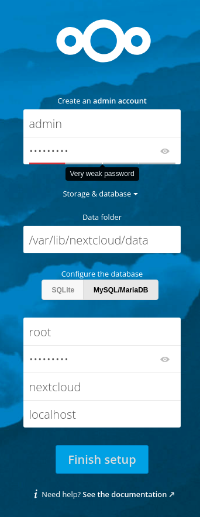

# Postavte si vlastní cloud s Fedorou 31 a Nextcloud serverem

*Tento článek je přeložen z anglické verze na [fedoramagazine.org](https://fedoramagazine.org/build-your-own-cloud-with-fedora-31-and-nextcloud-server/)*

Nextcloud je nástrojem pro ukládání a synchronizaci vašich dat mezi více zařízeními. Jinak řečeno, s pomocí Nextcloudu si můžete udělat vlastní osobní cloud pro synchronizaci svých souborů. Pokud se chcete dozvědět, co všechno Nextcloud umí, podívejte se třeba [sem](https://github.com/nextcloud/server). 

V tomhle článku si ukážeme, jak si takový osobní cloud postavit s použitím Fedory 31 a Nextcloudu, to všechno v několika jednoduchých krocích. 

## Krok 1: Co budeme potřebovat

Pro začátek budeme potřebovat počítač nebo virtuální stroj s Fedorou 31 server a pčipojení k internetu. Předtím, než začneme instalovat a konfigurovat Nextcloud, musíme stáhnout a nainstalovat několik prerekvizit. Nejdříve nainstalujeme Apache web server:

~~~
# dnf install httpd
~~~

Dále budeme potřebovat několik PHP modulů. Kromě jiného se verze našeho PHP musí shodovat s [požadavky Nextcloudu](https://docs.nextcloud.com/server/17/admin_manual/installation/system_requirements.html#server):

~~~
# dnf install php php-gd php-mbstring php-intl php-pecl-apcu php-mysqlnd php-pecl-redis php-opcache php-imagick php-zip php-process
~~~

Když už máme připravené PHP, můžeme spustit Apache server:

~~~
# systemctl enable --now httpd
~~~

Dále povolíme HTTP provoz skrz firewall: 

~~~
# firewall-cmd --permanent --add-service=http
# firewall-cmd --reload
~~~

Teď si nainstalujeme MariaDB klienta i server a ten zapneme:

~~~
# dnf install mariadb mariadb-server
# systemctl enable --now mariadb
~~~

Nyní, když už nám na našem serveru běží MariaDB, můžeme si ji zabezpečit příkazem _mysql_secure_installation_:

~~~
# mysql_secure_installation

NOTE: RUNNING ALL PARTS OF THIS SCRIPT IS RECOMMENDED FOR ALL
      MariaDB SERVERS IN PRODUCTION USE!  PLEASE READ EACH STEP
      CAREFULLY!

In order to log into MariaDB to secure it, we'll need the
current password for the root user.  If you've just installed
MariaDB, and you haven't set the root password yet, the password
will be blank, so you should just press enter here.

Enter current password for root (enter for none): <ENTER>
OK, successfully used password, moving on...

Setting the root password ensures that nobody can log into
the MariaDB root user without the proper authorization.

Set root password? [Y/n] <ENTER>
New password: Your_Password_Here
Re-enter new password: Your_Password_Here

Password updated successfully!

Reloading privilege tables...
 ... Success!

By default, a MariaDB installation has an anonymous user,
allowing anyone to log into MariaDB without having to have
a user account created for them.  This is intended only for
testing, and to make the installation go a bit smoother.  You
should remove them before moving into a production environment.

Remove anonymous users? [Y/n] <ENTER>
 ... Success!

Normally, root should only be allowed to connect from
'localhost'.  This ensures that someone cannot guess at the
root password from the network.

Disallow root login remotely? [Y/n] <ENTER>
 ... Success!

By default, MariaDB comes with a database named 'test' that
anyone can access.  This is also intended only for testing, and
should be removed before moving into a production environment.

Remove test database and access to it? [Y/n] <ENTER>

 - Dropping test database...
 ... Success!

 - Removing privileges on test database...
 ... Success!

Reloading the privilege tables will ensure that all changes
made so far will take effect immediately.

Reload privilege tables now? [Y/n] <ENTER>
 ... Success!

Cleaning up...

All done!  If you've completed all of the above steps, your
MariaDB installation should now be secure.

Thanks for using MariaDB!
~~~

Jako poslední si vytvoříme uživatele a databázi pro Nextcloud:

~~~
# mysql -p
> create database nextcloud;
> create user 'nc_admin'@'localhost' identified by 'SeCrEt';
> grant all privileges on nextcloud.* to 'nc_admin'@'localhost';
> flush privileges;
> exit;
~~~

## Krok 2: Instalace Nextcloud serveru

Teď, když jsme splnili všechny prerekvizity, si stáhneme a rozzipujeme [Nextcloud archiv](https://nextcloud.com/install/#instructions-server): 

~~~
# wget https://download.nextcloud.com/server/releases/nextcloud-17.0.2.zip
# unzip nextcloud-17.0.2.zip -d /var/www/html/
~~~ 

Dále vytvoříme složku pro data a upravíme práva tak, aby Apache mohl v této složce libovolně zapisovat a číst:

~~~
# mkdir /var/www/html/nextcloud/data
# chown -R apache:apache /var/www/html/nextcloud
~~~

Nnyí musíme správně nakonfigurovat SELinux tak, aby pracoval s Nextloudem. Základní příkazy jsou níže, ale mnohem víc jich můžeme najít například [zde](https://docs.nextcloud.com/server/17/admin_manual/installation/selinux_configuration.html).

~~~
# semanage fcontext -a -t httpd_sys_rw_content_t '/var/www/html/nextcloud/config(/.*)?'
# semanage fcontext -a -t httpd_sys_rw_content_t '/var/www/html/nextcloud/apps(/.*)?'
# semanage fcontext -a -t httpd_sys_rw_content_t '/var/www/html/nextcloud/data(/.*)?'
# semanage fcontext -a -t httpd_sys_rw_content_t '/var/www/html/nextcloud/.user.ini'
# semanage fcontext -a -t httpd_sys_rw_content_t '/var/www/html/nextcloud/3rdparty/aws/aws-sdk-php/src/data/logs(/.*)?'
# restorecon -Rv '/var/www/html/nextcloud/'
~~~

## Krok 3: Konfigurace Nextcloudu

Tady máme dvě možnosti: buď Nextcloud nakonfigurujeme přes webové rozhraní nebo v terminálu. Níže jsou popsané obě možnosti.

### Konfigurace přes webové rozhraní

Do prohlížeče přistoupíme na adresu _http://your_server_ip/nextcloud_ a vyplníme údaje:

### Konfigurace v terminálu

Pro konfiguraci v terminálu nám postačí jediný příkaz, kde jen upravíme hodnoty podle našeho konkrétního nastavení. Přo přehlednost jsou upravitelné hodnoty zvýrazněné \<takhle\>. 

~~~
# sudo -u apache php occ maintenance:install --data-dir /var/www/html/nextcloud/data/ --database "mysql" --database-name <"nextcloud"> --database-user <"nc_admin"> --database-pass <"DB_SeCuRe_PaSsWoRd"> --admin-user <"admin"> --admin-pass <"Admin_SeCuRe_PaSsWoRd">
~~~

## Poznámky na závěr

* V článku je použitý protokol _http_, ale Nextcloud umí i _https_.

* Doporučený limit paměti PHP pro Nextcloud je 512 MB, hodnota jde změnit tak, že editujeme proměnnou _memory limit_ v konfiguračním souboru _/etc/php.ini_ a restartujeme službu _httpd_.

